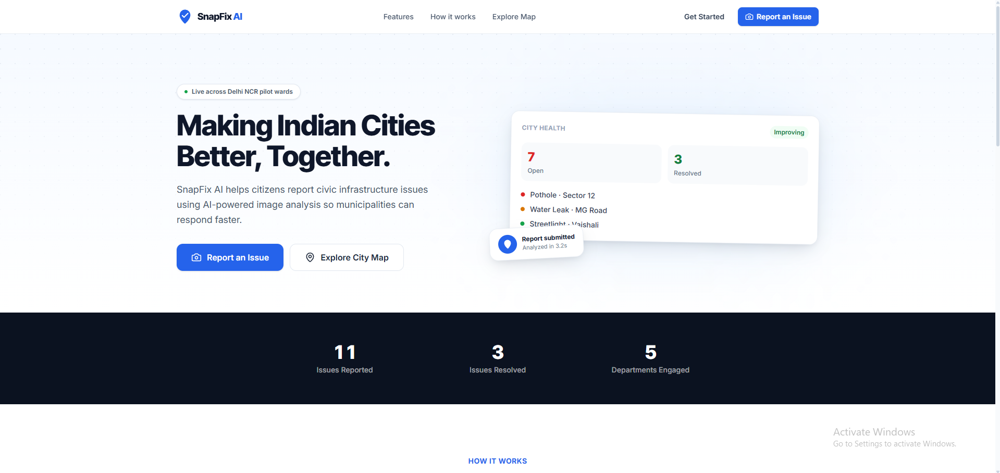
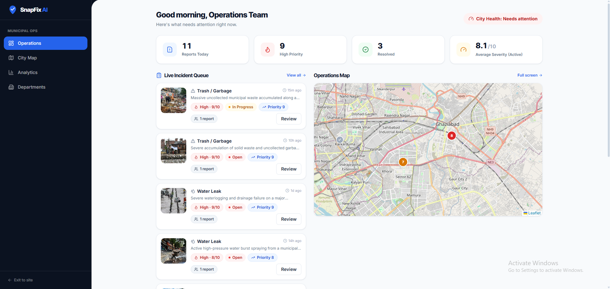
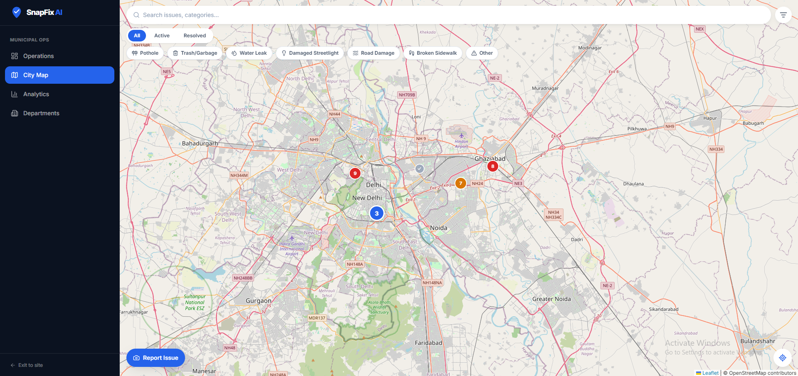
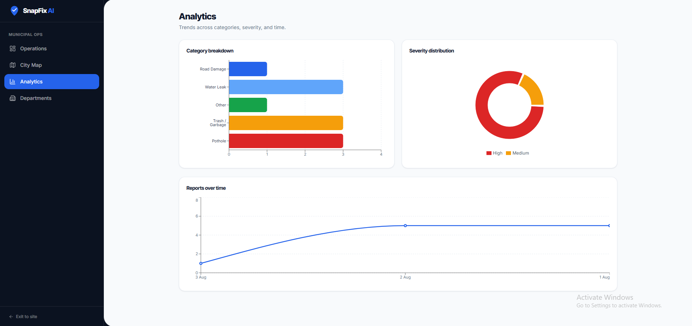

<div align="center">

# 🚀 SnapFix AI

### AI-Powered Civic Issue Reporting & Municipal Operations Platform

Transforming civic issue reporting through **Computer Vision**, **Geospatial Intelligence**, and **Modern Full-Stack Engineering**.

---


</div>

---

# 🌍 Overview

SnapFix AI is a modern **AI-powered civic issue management platform** designed to bridge the communication gap between citizens and municipal authorities.

Citizens can report infrastructure issues such as potholes, garbage accumulation, damaged streetlights, water leaks, and road damage simply by uploading a photograph. The platform intelligently analyzes each submission using Google's Gemini Vision AI, extracts or validates its location, identifies duplicate reports, prioritizes incidents based on severity and community engagement, and presents municipal teams with an operational dashboard for efficient resolution.

Rather than functioning as a simple reporting application, SnapFix AI delivers an **end-to-end workflow** that spans from citizen submission to municipal action.

---

# 🎯 Vision

Cities receive thousands of infrastructure complaints every day. Unfortunately, many of these reports are:

- duplicated multiple times
- manually classified
- incorrectly prioritized
- difficult to track
- slow to reach the responsible department

SnapFix AI aims to modernize this process through artificial intelligence and intelligent automation.

By combining image understanding, geospatial intelligence, and operational analytics, the platform enables municipalities to respond faster while giving citizens greater transparency into the status of their reports.

---

# ❗ Problem Statement

Traditional civic reporting systems suffer from several challenges:

- Manual categorization of reports
- Duplicate complaints creating unnecessary workload
- Lack of automated prioritization
- Poor visibility into issue status
- Limited analytical insights for decision makers
- Fragmented communication between citizens and municipal departments

These inefficiencies lead to delayed resolutions, wasted resources, and reduced public trust.

---

# 💡 Solution

SnapFix AI introduces an AI-assisted workflow that automates much of the municipal reporting process.

Instead of relying on manual review, every uploaded report passes through an intelligent processing pipeline that:

- validates uploaded images
- determines the issue category
- estimates severity
- extracts geographical information
- detects duplicate reports
- calculates operational priority
- generates municipal work orders
- visualizes incidents on interactive maps
- tracks report progress until resolution

The result is a faster, smarter, and more scalable civic issue management platform.

---

# ✨ Key Features

## 👥 Citizen Portal

Designed to make reporting infrastructure issues simple and intuitive.

### 📸 AI-Powered Issue Reporting

Citizens upload a photo of a civic issue through a guided multi-step reporting experience.

The backend automatically:

- analyzes the uploaded image
- identifies infrastructure hazards
- generates concise issue summaries
- estimates severity
- classifies the issue into predefined municipal categories

---

### 🗺️ Intelligent Location Detection

SnapFix AI supports multiple methods of determining incident location.

Priority order:

1. Embedded EXIF GPS metadata
2. Browser geolocation
3. Manual map selection (where applicable)

This ensures every report contains accurate spatial information.

---

### 📋 Personal Report Tracking

Users can monitor previously submitted reports through the "My Reports" interface.

Reports remain accessible across sessions through lightweight client-side persistence.

---

### 📄 PDF Report Generation

Citizens and municipal officers can generate downloadable PDF reports containing:

- issue summary
- category
- severity
- coordinates
- uploaded image
- current status

---

### 🌍 Interactive Public Map

The application visualizes reported incidents across the city using an interactive Leaflet map.

Users can explore:

- active reports
- issue locations
- severity indicators
- report details

---

## 🏛️ Municipal Operations Dashboard

The municipal workspace functions as an operational command center rather than a traditional admin panel.

It provides dedicated interfaces for managing city-wide infrastructure issues.

### 📊 Operational Dashboard

Municipal officers can monitor:

- total reports
- active incidents
- resolved issues
- high-priority cases
- live operational metrics

---

### 🗺️ GIS Operations Map

A dedicated mapping interface provides spatial awareness of reported infrastructure issues.

Officers can quickly identify:

- issue clusters
- priority hotspots
- geographic distribution
- report locations

---

### 📈 Analytics & Insights

SnapFix AI provides analytical dashboards including:

- category distribution
- status breakdown
- report trends
- priority reports
- departmental metrics

These insights help municipalities allocate resources more effectively.

---

### 🔄 Incident Lifecycle Management

Reports progress through a structured lifecycle:

```

OPEN
↓
IN_PROGRESS
↓
RESOLVED

```

Municipal teams can update incident status while maintaining complete visibility throughout the workflow.

---

# 🤖 AI Intelligence

Artificial Intelligence is integrated throughout the reporting pipeline rather than being treated as an isolated feature.

Gemini Vision AI assists with:

- infrastructure recognition
- category classification
- severity estimation
- executive summary generation
- civic issue validation

Non-civic images (such as selfies, pets, or unrelated photographs) are automatically rejected before entering the municipal workflow.

---

# 🚀 What Makes SnapFix AI Different?

Many civic reporting applications simply collect complaints.

SnapFix AI goes significantly further by combining modern AI techniques with intelligent municipal workflows.

## 🧠 AI-Assisted Infrastructure Understanding

Images are analyzed automatically to determine the nature and severity of infrastructure problems.

---

## 📍 Hybrid Duplicate Detection

Instead of comparing only image similarity, SnapFix AI combines:

- Perceptual Image Hashing
- Geospatial Distance Calculations

This allows multiple reports describing the same real-world issue to be intelligently merged into a single municipal ticket.

---

## ⭐ Dynamic Priority Engine

Incident priority evolves over time.

Rather than relying solely on AI severity scores, SnapFix AI also considers community engagement by increasing priority as duplicate reports accumulate.

This ensures frequently reported issues naturally rise within municipal workflows.

---

## 🏙️ Dual-Portal Experience

Unlike many reporting platforms, SnapFix AI provides dedicated experiences for different user groups.

### Citizen Portal

Focused on:

- simple reporting
- report tracking
- transparency
- accessibility

### Municipal Dashboard

Focused on:

- operational efficiency
- analytics
- resource allocation
- incident management

Each interface is optimized specifically for its intended users.

---
# 🏗️ System Architecture

SnapFix AI follows a modular full-stack architecture that separates presentation, business logic, AI processing, and persistence into independent layers.

```text
                                +----------------------+
                                |      Citizens        |
                                +----------+-----------+
                                           |
                                           | Upload Image
                                           |
                                           ▼
                            +-------------------------------+
                            |      React Frontend (SPA)     |
                            |-------------------------------|
                            | Citizen Portal                |
                            | Municipal Dashboard           |
                            | Interactive Maps              |
                            | Analytics                     |
                            +---------------+---------------+
                                            |
                                  REST API (Axios)
                                            |
                                            ▼
                          +----------------------------------+
                          |       FastAPI Backend            |
                          |----------------------------------|
                          | Request Validation               |
                          | Report Processing Pipeline       |
                          | Analytics Engine                |
                          | PDF Generation                  |
                          +---------------+------------------+
                                          |
               +--------------------------+---------------------------+
               |                          |                           |
               ▼                          ▼                           ▼
      +----------------+        +-------------------+       +----------------+
      | Gemini Vision  |        | Spatial Utilities |       | SQLite Database|
      | AI             |        | EXIF + Hashing    |       | Report Storage |
      +----------------+        +-------------------+       +----------------+

```

---

# 🔄 End-to-End Workflow

Every report submitted through SnapFix AI follows an intelligent processing pipeline designed to minimize manual intervention while maintaining data quality.

```text
Citizen uploads image
        │
        ▼
Frontend Validation
        │
        ▼
FastAPI API Endpoint
        │
        ▼
File Validation
(Size • Format • MIME)
        │
        ▼
Location Resolution
(EXIF → Browser GPS)
        │
        ▼
Perceptual Image Hash
        │
        ▼
Gemini Vision Analysis
        │
        ▼
Duplicate Detection
(Hash + Geospatial Distance)
        │
        ▼
Priority Calculation
        │
        ▼
Database Storage
        │
        ▼
Municipal Dashboard
        │
        ▼
Status Updates
        │
        ▼
Resolved
```

This pipeline allows SnapFix AI to automate much of the work that would traditionally require manual municipal review.

---

# 🛠️ Technology Stack

## Frontend

| Technology | Purpose |
|------------|---------|
| React 19 | Component-based UI |
| TypeScript | Type safety |
| Vite | Development & Production Build Tool |
| Tailwind CSS v4 | Utility-first styling |
| React Router v7 | Client-side routing |
| Axios | Backend communication |
| Framer Motion | Animations |
| React Hook Form | Form handling |
| Leaflet + React Leaflet | Interactive maps |
| Recharts | Municipal analytics |
| Lucide React | Icon system |

---

## Backend

| Technology | Purpose |
|------------|---------|
| FastAPI | REST API framework |
| SQLAlchemy | ORM |
| Pydantic v2 | Validation & serialization |
| Uvicorn | ASGI Server |
| SQLite | Database |
| ReportLab | PDF generation |
| Pillow | Image processing |
| imagehash | Perceptual hashing |

---

## Artificial Intelligence

SnapFix AI integrates Google's Gemini Vision model to automate infrastructure analysis.

The AI assists with:

- infrastructure recognition
- category classification
- severity estimation
- executive summaries
- civic issue validation

Rather than exposing raw model responses, the backend converts AI output into structured domain data that can be safely consumed throughout the application.

---

## Mapping & Spatial Intelligence

Spatial functionality is a core component of SnapFix AI.

Features include:

- Interactive Leaflet maps
- EXIF GPS extraction
- Browser geolocation fallback
- Haversine distance calculations
- Incident clustering
- Location-based duplicate detection

---

# 📂 Project Structure

```text
SnapFix-AI/
│
├── frontend/
│   ├── src/
│   │   ├── components/
│   │   ├── pages/
│   │   ├── hooks/
│   │   ├── context/
│   │   ├── lib/
│   │   ├── types/
│   │   └── App.tsx
│   │
│   ├── public/
│   ├── package.json
│   └── vite.config.ts
│
├── backend/
│   ├── app/
│   │   ├── core/
│   │   ├── routers/
│   │   ├── models/
│   │   ├── schemas/
│   │   ├── services/
│   │   └── utils/
│   │
│   ├── uploads/
│   ├── requirements.txt
│   └── main.py
│
└── README.md
```

The project adopts a layered architecture where each module has a clearly defined responsibility, improving maintainability and future scalability.

---

# 📡 API Overview

The frontend communicates with the backend through a RESTful API.

## Reports

| Method | Endpoint | Description |
|--------|----------|-------------|
| POST | `/api/v1/reports` | Submit new civic issue |
| GET | `/api/v1/reports` | Retrieve reports |
| GET | `/api/v1/reports/{id}` | Report details |
| PATCH | `/api/v1/reports/{id}/status` | Update issue status |
| GET | `/api/v1/reports/{id}/pdf` | Download work order |

---

## Analytics

| Method | Endpoint |
|--------|----------|
| GET | `/api/v1/analytics` |

Returns:

- category statistics
- report counts
- status distribution
- priority reports

---

## Health

| Method | Endpoint |
|--------|----------|
| GET | `/health` |

Used for deployment health checks and monitoring.

---

# 🗄️ Database Design

At the core of SnapFix AI is a report-centric data model.

Each report stores:

- uploaded image
- AI classification
- AI-generated summary
- severity score
- operational priority
- geographic coordinates
- report status
- community upvotes
- timestamps

Rather than acting as a simple storage layer, the database supports the platform's operational workflow by enabling analytics, duplicate detection, prioritization, and report lifecycle management.

---

# 🧩 Engineering Highlights

Several implementation decisions distinguish SnapFix AI from a typical CRUD application:

- Modular service-oriented backend architecture
- AI encapsulated behind dedicated service layers
- Hybrid duplicate detection using image hashing and geospatial proximity
- Dynamic incident prioritization
- Reusable frontend component architecture
- Interactive GIS visualization
- Automated PDF work order generation
- Comprehensive validation pipeline
- Citizen and municipal experiences tailored to different user needs

These choices make the project easier to extend while providing a richer user experience.

# 🚀 Getting Started

## Prerequisites

Before running SnapFix AI locally, ensure the following are installed:

### Frontend

- Node.js **18+**
- npm

### Backend

- Python **3.10+**
- pip
- Virtual Environment (`venv`)

### AI

- Google Gemini API Key

---

# 📥 Installation

## 1. Clone the Repository

```bash
git clone https://github.com/<your-username>/SnapFix-AI.git

cd SnapFix-AI
```

---

## 2. Backend Setup

Navigate to the backend directory.

```bash
cd backend
```

Create a virtual environment.

### Windows

```powershell
python -m venv .venv

.venv\Scripts\activate
```

### Linux / macOS

```bash
python3 -m venv .venv

source .venv/bin/activate
```

Install dependencies.

```bash
pip install -r requirements.txt
```

---

### Configure Environment Variables

Create a `.env` file.

```env
PROJECT_NAME="SnapFix AI"

DATABASE_URL="sqlite:///./snapfix.db"

GEMINI_API_KEY="YOUR_API_KEY"
```

---

### Start FastAPI

```bash
uvicorn main:app --reload
```

Backend

```
http://localhost:8000
```

Swagger

```
http://localhost:8000/docs
```

---

## 3. Frontend Setup

Open another terminal.

```bash
cd frontend
```

Install packages.

```bash
npm install
```

Create

```
.env
```

```env
VITE_API_BASE_URL=http://localhost:8000
```

Run the frontend.

```bash
npm run dev
```

Application

```
http://localhost:5173
```

---

## 🚀 Live Demo

- **Frontend:** https://snap-fix-ai-gamma.vercel.app/
- **Backend API:** https://snapfix-ai-aury.onrender.com

> **Note:** The backend runs on Render's free tier and may take 30–90 seconds to wake up after about 15 minutes of inactivity.
---

# 📷 Screenshots

## Landing Page



---

## Citizen Dashboard


---

## Report Wizard


---

## Municipal Dashboard



---

## Operations Map



---

## Analytics



---

# 🔮 Future Improvements

The current implementation provides a strong foundation for future expansion.

Potential enhancements include:

- User Authentication & Role-Based Access Control
- PostgreSQL Migration
- Redis Caching
- WebSocket-based Live Updates
- Push Notifications
- Mobile Application
- Multi-language Support
- Cloud Object Storage (AWS S3 / Cloudinary)
- Background Task Queue
- ML-based Severity Prediction
- GIS Heatmaps
- Administrative Audit Logs
- Offline Reporting
- Predictive Infrastructure Analytics

---

# 🤝 Contributing

Contributions, suggestions, and feedback are welcome.

If you'd like to improve SnapFix AI:

1. Fork the repository
2. Create a feature branch
3. Commit your changes
4. Push your branch
5. Open a Pull Request

---

# 📜 License

This project is licensed under the **MIT License**.

---

# 👨‍💻 Author

Developed by **Ishaan Nautiyal,Vaibhav Bisht, Aashi Jindal, Devanshi Bisht**

Built with a passion for AI, cybersecurity, and modern software engineering.

---

# ⭐ Why This Project Matters

Infrastructure issues affect millions of people every day, yet the systems used to report and resolve them often remain slow, fragmented, and heavily manual.

SnapFix AI demonstrates how artificial intelligence, geospatial intelligence, and modern web technologies can be combined into a practical platform that streamlines civic issue reporting, improves operational efficiency, and increases transparency between citizens and municipal authorities.

Rather than serving as a proof of concept, SnapFix AI showcases how thoughtfully integrated AI can solve real-world problems by supporting—not replacing—human decision-making.

---

<div align="center">

### ⭐ If you found this project interesting, consider giving it a star!

Built using **FastAPI**, **React**, **TypeScript**, **Gemini AI**, **Leaflet**, and **Modern Full-Stack Engineering**.

</div>